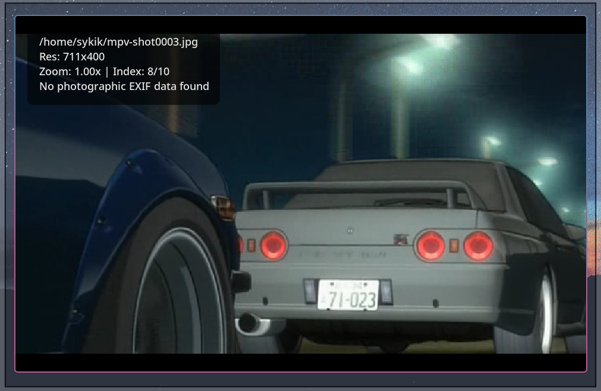

# fey

fey is a minimalistic, high-performance image viewer for Wayland, written in C++. It focuses on speed, smooth animations, and efficiency.


<p align="center">
  
</p>

## Features

- **Performance**: Direct-to-SHM rendering for zero-copy buffer updates.
- **Smooth Animations**: Hardware-synchronized rubber-band physics for zoom and pan limits.
- **GIF Support**: Full animated GIF playback with adaptive frame-rate synchronization.
- **Energy Efficient**: Adaptive refresh rate and intelligent event throttling to minimize CPU/Power usage.
- **Metadata**: Pre-cached EXIF photographic metadata display using `exiv2`.
- **Gestures**: Native Wayland pinch-to-zoom and pan support.

## Install From AUR 

- paru
- `paru -S fey`
- yay
- `yay -S fey`

## Build & Install

### Dependencies
- `wayland`
- `wayland-protocols`
- `cairo`
- `exiv2` (for metadata)

### Compile
```bash
make
```

### Install
```bash
sudo make install
```

## Hotkeys

- `q`: Quit
- `Left` / `Right`: Previous / Next image
- `+` / `-`: Zoom in / out (discrete steps)
- `Ctrl + Arrow Keys`: Pan image
- `f`: Toggle fullscreen
- `i`: Toggle info overlay
- **Mouse Drag**: Pan image
- **Pinch Gesture**: Zoom/Pan

## License
MIT
